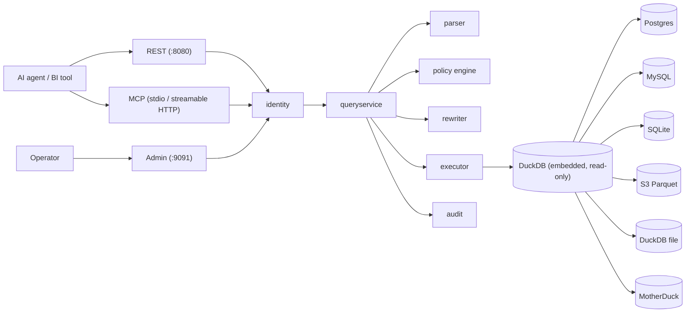

<!-- SPDX-License-Identifier: CC-BY-4.0 -->

# Architecture

Sluice is a policy decision point and a policy enforcement point in a single process. Instead of
trusting every application, agent, or notebook to filter rows and hide columns in code, you place
Sluice between the caller and the data: it parses each SQL statement, decides what the caller may
see, **rewrites the statement** so the database itself can only return the permitted result, and
appends a hash-chained audit record for every request — allowed or denied.

One orchestrator, `internal/queryservice`, runs the entire pipeline. The REST API, the MCP server,
and the admin plane are thin transports over that one service, so a policy decision is identical no
matter which door a query came through. The full pipeline is described stage by stage in
[Request lifecycle](request-lifecycle.md).

## Component map

Execution happens in embedded DuckDB. The six datasource types are attached as read-only catalogs,
which is what makes cross-source joins possible: to the rewritten query, a Postgres table and a
Parquet prefix are just two catalogs in the same engine. See
[Data sources](../operations/data-sources.md).

## Package tour

The repository is split by license and by trust: `pkg/` is the public, Apache-2.0 API surface;
`internal/` is the AGPL-3.0-or-later runtime; `cmd/sluice` (the CLI) is the only composition root
allowed to wire them together.

### `pkg/` — public API (Apache-2.0)

| Package | Purpose |
| --- | --- |
| `pkg/apitypes` | Policy document types for all 11 kinds, selectors, enums |
| `pkg/mask` | Mask provider interface and the `Args` contract mirrored by `apitypes.MaskArgs` |
| `pkg/datasource` | Driver interface implemented by datasource attachments |
| `pkg/errors` | Error catalog: `APIError`, the 24 canonical codes, query IDs |

### `internal/` — the gateway runtime (AGPL-3.0-or-later)

| Package | Purpose |
| --- | --- |
| `internal/queryservice` | Pipeline orchestrator shared by all transports |
| `internal/transport` | REST, MCP, and admin HTTP servers |
| `internal/identity` | JWT and API-key authentication, subject bindings |
| `internal/parser` (+ `parserbackend`, `pgquery`) | pg_query PostgreSQL-grammar parsing, query shape and table extraction |
| `internal/policy` | YAML engine: selectors, CEL, conflict resolution, composite merging |
| `internal/opaengine` | Embedded OPA (Rego) engine |
| `internal/rebac` | OpenFGA-backed `RelationshipPolicy` composite member |
| `internal/rewriter` | AST rewriting: star expansion, row filters, masks, LIMIT, sampling |
| `internal/executor` | Runs rewritten SQL on DuckDB and streams rows |
| `internal/datasource` | Attaches the six source types to DuckDB as read-only catalogs |
| `internal/schema` | Column-metadata cache for star expansion and mask resolution |
| `internal/audit` | Hash-chained JSONL records, sinks, bounded dispatcher |
| `internal/approval` | In-memory approval broker, capability tokens, webhook notifier |
| `internal/ratelimit` | Per-subject token buckets |
| `internal/budget` | Per-subject daily budgets backed by SQLite |
| `internal/policycache` | LRU cache of (decision, rewrite) pairs |
| `internal/policytest` | The `sluice policy test` harness |
| `internal/config` | Server config, policy-directory loader, snapshot registry, reload watcher |
| `internal/secrets` | `secret://` reference resolver (`env` and `file` schemes) |
| `internal/telemetry` | Structured logging, redaction helpers, Prometheus metrics |

## Design tenets

- **Default-deny.** An empty `policies.d/` is a valid configuration meaning "deny everything." No
  matching allow policy means no data, and an engine with no active snapshot also denies.
- **Fail-closed audit.** By default a query is not served unless its audit record is durably
  enqueued first — the audit trail is a precondition, not a side effect.
- **Read-only execution.** The rewriter and executor allow only `SELECT`, `EXPLAIN`, `SET`, `SHOW`,
  and `PRAGMA`; writes are rejected, and datasources are attached `READ_ONLY`.
- **Declarative policies.** Enforcement lives in versionable YAML (or Rego), not in application
  code, and hot-reloads without a restart.
- **Bound parameters, never string splicing.** Row-filter values and template references are
  rendered as `$N` placeholders with bound parameters, so a policy value can never inject SQL.

## Policy load flow

1. **Read** — every `*.yaml` / `*.yml` under `policies.d/` is loaded recursively (dot-directories,
   `testdata`, and `tests` are skipped). Multi-document files separated by `---` are supported.
2. **Decode and validate** — documents are decoded into the 11 policy kinds; a duplicate kind/name
   pair or an invalid document fails the load.
3. **Compile** — selectors, CEL programs, templates, and mask arguments are compiled into an
   immutable snapshot.
4. **Atomic swap** — the engine swaps the snapshot pointer; in-flight evaluations keep the view
   they started with. A snapshot that fails to compile is rejected and the previous one stays live.

Reloads are triggered by a filesystem watcher on the policy directory (250 ms debounce), by
`SIGHUP`, or by `POST /admin/reload`. Subscribers rebuild API-key bindings and rate-limit/budget
specs, purge the rewrite cache, and invalidate the schema cache. See
[Hot reload](../operations/hot-reload.md).

## Read on

- [Request lifecycle](request-lifecycle.md) — every stage between `POST /v1/query` and the first row.
- [Policy engines](policy-engines.md) — YAML, OPA, ReBAC, and how the composite merges them.
- [Security model](security-model.md) — trust boundaries and the fail-closed inventory.
