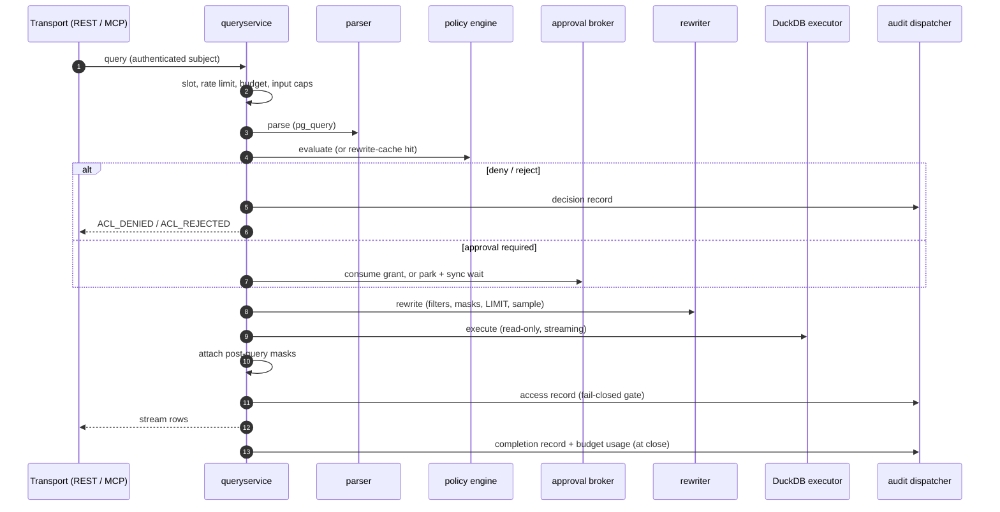

<!-- SPDX-License-Identifier: CC-BY-4.0 -->

# Request lifecycle

Every query — REST or MCP — runs the same pipeline in `internal/queryservice`; the admin plane's
explain simulation reuses the same policy-evaluation path without executing.
Each stage can terminate the request with a typed error code; anything that survives all gates
streams rows back to the client and leaves a hash-chained audit trail.

## Admission

1. **Concurrency slot.** `limits.maxConcurrent` caps in-flight requests; a saturated service
   returns `ERR_RATE_LIMITED` after a short grace wait.
2. **Per-subject rate limit.** A token bucket keyed on the subject (falling back to the issuer)
   enforces the SubjectBinding's `rateLimit{rps, burst}`; over the limit is `ERR_RATE_LIMITED`.
3. **Daily budget.** If budgets are enabled, the subject's CPU-seconds and rows-served ledger is
   checked before any work; an exhausted budget returns `ERR_BUDGET_EXCEEDED`.
4. **Input caps.** SQL larger than `limits.maxSqlBytes` returns `ERR_PAYLOAD_TOO_LARGE`. The
   requested timeout and row count are clamped to the configured ceilings — tightened, never
   rejected.

## Parse

The statement is parsed with pg_query, the real PostgreSQL grammar. If parsing fails, a regex
fallback still extracts table names so policy can evaluate — and deny — the request. A parse error
(`ERR_SYNTAX`, `ERR_MULTIPLE_STATEMENTS`, `ERR_UNSUPPORTED_SYNTAX`) is only surfaced when policy
would otherwise have allowed the query: a deny or reject always takes precedence, so a caller
cannot use syntax probing to map what they are denied.

## Policy evaluation

The configured engine (see [Policy engines](policy-engines.md)) produces a decision: outcome, row
filters, column masks, rewrite effects, rejections, and any approval requirement.

- **Rewrite cache.** With `cache.rewrite.enabled: true`, the (decision, rewrite) pair is memoised
  in an LRU cache. The key binds the active snapshot's version and digest, a hash of the raw SQL
  text, and a hash of the caller's identity — so a policy reload, a different query, or a different
  subject can never hit a stale entry. Only cleanly parsed queries are cacheable, and rate limits,
  budgets, approvals, and audit still run on every request.
- **Enforcement mode.** Only `enforcementMode: Enforce` policies (the default) shape the decision.
  `Audit` and `DryRun` policies are evaluated and recorded as shadow entries in the decision and
  audit record, but change nothing.
- **Short-circuit.** A deny terminates with `ACL_DENIED` (message and code from the
  highest-priority deny policy); a fired reject rule terminates with `ACL_REJECTED` or the rule's
  custom code.

## Approval gate

If the decision requires human approval, the service first tries to consume an existing single-use
grant for this subject and exact SQL hash — a granted re-run proceeds directly. Otherwise the
request is parked with the broker (the admission slot is released first), webhooks fire, and the
service waits up to `approval.syncWait` (default 20 s, bounded by the request deadline). Approval
within the window re-runs the pipeline once, consuming the grant. Otherwise the caller gets
`ERR_APPROVAL_PENDING` (HTTP 202) with the approval id; a rejection returns
`ERR_APPROVAL_REJECTED`, an expiry `ERR_APPROVAL_EXPIRED`. A full broker fails closed with
`ERR_RATE_LIMITED`. Details in [Approvals](../policies/approvals.md).

## Rewrite

The rewriter applies the decision to the AST: `SELECT *` is expanded against the schema cache; row
filters are injected by wrapping the table in a subquery whose `WHERE` predicate uses bound `$N`
parameters (values are never spliced into SQL text); column masks replace expressions in the target
list; a `LIMIT` is injected when absent and a constant `LIMIT` above the cap is clamped; a sampling
instruction wraps the statement in `SELECT * FROM (<sql>) AS sluice_sample USING SAMPLE <r>%
(<method>)`. Only `SELECT`, `EXPLAIN`, `SET`, `SHOW`, and `PRAGMA` are allowed:
`INSERT`/`UPDATE`/`DELETE` return `ACL_REJECTED`, and DDL/`COPY`/`ATTACH` return
`ERR_UNSUPPORTED_SYNTAX`. A `QueryRewritePolicy` timeout or row cap tightens the request-level
clamps from admission — it never loosens them.

## Execute

The rewritten SQL runs on embedded DuckDB against read-only attached catalogs, streaming rows
through an iterator. The timeout is enforced by the service context (not injected into SQL) and
maps to `ERR_TIMEOUT`; a client disconnect maps to `ERR_CANCELED`.

## Post-query masks

Masks of type `hash` with `algorithm: hmac_sha256`, `fpe`, `jitter`, and `fake` are applied in Go
to the result rows rather than rewritten into SQL: they need keyed cryptography or deterministic
fake-data generation that cannot be expressed as a portable SQL expression. The mask decorators are
built *before* the audit gate, so a construction failure (for example an unresolvable key
reference) refuses the query with nothing served.

## Audit gate and streaming

Before the first row reaches the caller, the access record must be durably enqueued with the audit
dispatcher. If it cannot be — queue full past the enqueue deadline — the query is refused with
`ERR_AUDIT_UNAVAILABLE` and no rows are served. This is the default (`audit.failClosed: true`);
setting it to `false` logs the failure and serves the query anyway. Closing the row iterator emits
a best-effort completion record carrying the final row count and records budget usage (execution
CPU time and rows served; client streaming time is deliberately excluded).

## Terminating error codes by stage

| Stage | Codes |
| --- | --- |
| Concurrency slot | `ERR_RATE_LIMITED` |
| Rate limit | `ERR_RATE_LIMITED` |
| Budget | `ERR_BUDGET_EXCEEDED` |
| Input caps | `ERR_PAYLOAD_TOO_LARGE` |
| Parse | `ERR_SYNTAX`, `ERR_MULTIPLE_STATEMENTS`, `ERR_UNSUPPORTED_SYNTAX` (surfaced only on allow) |
| Policy | `ACL_DENIED`, `ACL_REJECTED` (or a policy's custom code) |
| Approval | `ERR_APPROVAL_PENDING`, `ERR_APPROVAL_REJECTED`, `ERR_APPROVAL_EXPIRED`, `ERR_RATE_LIMITED` (broker full) |
| Rewrite | `ACL_REJECTED` (writes), `ERR_UNSUPPORTED_SYNTAX`, `ERR_REWRITE_FAILED`, `ERR_MASK_UNSUPPORTED_CONTEXT` |
| Execute | `ERR_TIMEOUT`, `ERR_CANCELED`, `ERR_INTERNAL` |
| Audit gate | `ERR_AUDIT_UNAVAILABLE` |

The full catalog, with HTTP status mappings, is in [Error codes](../reference/error-codes.md).
