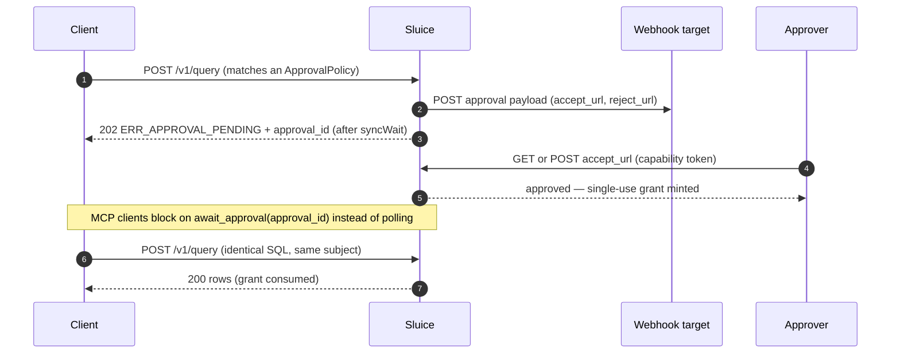

<!-- SPDX-License-Identifier: CC-BY-4.0 -->

# Human approvals

`ApprovalPolicy` parks a query that is *already allowed* until a human signs it off. Use it for
reads that are legitimate but sensitive — PII columns, salary data, exports scoped to a regulated
region — where you want a second pair of eyes instead of a hard deny. Precedence is structural:
**deny > reject > approval** — only a query that survives [access control](access-control.md) and
[guardrails](guardrails.md) can be parked.

## The flow



If the approver decides within `syncWait` (default 20 s), the original request resumes in-flight
and the client never sees a 202. The accept/reject URLs are capability URLs: the unguessable
token in the URL is the sole authorization — no approver login. Unknown id and bad token both
return an identical 404, and prefetch requests never mutate state.

## Triggers: `spec.when`

An empty `when` means the selector match alone triggers approval. Otherwise `columnsAccessed`
and `predicates` are OR'd — any hit triggers:

- `columnsAccessed` — wildcard patterns matched against every column the query references, both
  its full dotted form and its bare last segment (so `email` also matches `u.email`).
- `predicates[]` — `{column, op, value}` matched against WHERE/HAVING/JOIN comparisons. `column`
  is a wildcard pattern (required). `op` is a lowercase SQL token: `=`, `!=`, `<`, `<=`, `>`,
  `>=`, `like`, `ilike`, `in`, `isnull` — or `*` / empty for any operator. An empty `value`
  matches any literal; otherwise it must string-equal the normalized literal.

`spec.reason` is free text carried into the webhook payload and the approval's status
(`GET /v1/approvals/{id}` / `check_approval`); the pending error itself carries only
`approval_id` and `expires_at`.

!!! warning "Fail-closed on unparseable queries"
    When Sluice falls back to regex table extraction (no AST), a policy with a non-empty `when`
    is treated as **triggered** — the columns and comparisons cannot be inspected, so the query
    is parked rather than waved through.

## Broker semantics

Requests live in a state machine with five states: `pending`, `approved`,
`rejected`, `expired`, `consumed`.

- **Dedup** — a second identical query (same subject + same SQL hash) while a request is pending
  returns the existing `approval_id`; no second webhook fires.
- **TTLs** — a pending request expires after `requestTtl` (15 m). Accepting mints a grant that
  expires after `grantTtl` (5 m) if unclaimed.
- **Single use** — the grant is consumed by exactly one re-run of the identical query by the same
  subject. A further run parks again.
- **Idempotent decisions** — repeating the same verb (accept/accept) is a no-op; the conflicting
  verb after a decision is a `409` conflict.
- **Capacity** — at `maxPending` (1000) new requests are refused, fail-closed.

By default the state machine is in-memory: a restart drops pending requests and grants, and
callers simply re-submit. Set `approval.persist: true` and pending requests, unconsumed grants,
and their capability links survive a restart — the state lands in an SQLite file under
`approval.stateDir` with the tokens stored only as SHA-256 hashes, so the database (and its
backups) cannot mint a working link. Grants stay single-use across the restart boundary, no
webhook re-fires for restored requests, and requests that expired while the process was down
expire normally on the next tick. An in-flight *synchronous* wait does not survive the restart —
the caller's `syncWait` simply passes and the usual 202-then-poll flow takes over.

!!! warning "Single instance"
    Approvals are not replicated: with or without persistence, run one gateway instance per
    approval domain. Every lifecycle transition is written to the
    [audit trail](../security/audit.md) as `approval-requested/approved/rejected/expired` events.

## Server configuration

```yaml
# fragment of sluice.yaml — server configuration, not a policy
approval:
  publicBaseUrl: https://sluice.example.com  # required once any ApprovalPolicy loads (fail-closed)
  syncWait: 20s          # in-request wait for a decision before returning 202
  requestTtl: 15m        # how long a pending request lives
  grantTtl: 5m           # how long an unclaimed grant lives after accept
  maxPending: 1000       # cap on concurrent pending requests
  sqlSampleBytes: 2048   # cap on the SQL text carried in the webhook; 0 sends no SQL
  persist: false         # true: pending requests + grants survive restarts (SQLite)
  stateDir: ./state      # where approvals.db lives when persist is on
  webhooks:
    - url: https://hooks.example.com/sluice
      headersRef: secret://env/APPROVAL_WEBHOOK_HEADERS  # JSON header map: {"Authorization":"Bearer …"}
      timeout: 10s
```

Each webhook target is tried 3 times with exponential backoff. Delivery failure never fails the
query — the request stays pending until its TTL, with a loud log line.

## The webhook payload

```json
{
  "approval_id": "01JZX…",
  "subject": { "id": "alice", "issuer": "https://idp.example.com", "email": "alice@example.com", "groups": ["analysts"] },
  "sql": "SELECT ssn FROM shop.main.people WHERE country = 'de'",
  "reasons": ["policy approve-pii-reads: PII columns on people require a data-steward sign-off"],
  "policies": ["approve-pii-reads"],
  "accept_url": "https://sluice.example.com/v1/approvals/01JZX…/accept?token=…",
  "reject_url": "https://sluice.example.com/v1/approvals/01JZX…/reject?token=…",
  "requested_at": "2026-07-06T10:00:00Z",
  "expires_at": "2026-07-06T10:15:00Z"
}
```

## What the client sees

| Situation | Code | HTTP |
| --------- | ---- | ---- |
| Parked, no decision within `syncWait` | `ERR_APPROVAL_PENDING` | 202 |
| Approver rejected | `ERR_APPROVAL_REJECTED` | 403 |
| Request or grant timed out | `ERR_APPROVAL_EXPIRED` | 410 |

The 202 body carries `approval_id` and `expires_at` in its details. The client then either polls
`GET /v1/approvals/{id}` (authenticated — only the requesting subject may read it, anything else
is a 404) and re-runs the **identical** SQL once approved, or — over
[MCP](../reference/mcp.md) — calls `check_approval{approval_id}` for a one-shot status or
`await_approval{approval_id, timeout_seconds}` (capped server-side) to block until the
decision lands. See the
[error-code reference](../reference/error-codes.md) for the full code table.

## Recipes

**Approval on PII columns of one table, with a reason** — also fires on any query filtering
`country = 'de'` even when no PII column is selected:

```yaml
apiVersion: sluice.bino.bi/v1alpha1
kind: ApprovalPolicy
metadata: { name: approve-pii-reads, priority: 100 }
spec:
  match:
    any:
      - resources: { tables: ["shop.main.people"] }
  when:
    columnsAccessed: ["ssn", "salary*"]
    predicates:
      - { column: "country", op: "=", value: "de" }
  reason: "PII columns on people require a data-steward sign-off"
```

**Stage an approval without holding anyone** — `Audit` mode records a would-have-required-approval
shadow (visible as a shadow match in `sluice policy explain`) while queries keep flowing:

```yaml
apiVersion: sluice.bino.bi/v1alpha1
kind: ApprovalPolicy
metadata: { name: approve-exports-staged, priority: 90 }
spec:
  enforcementMode: Audit
  match:
    any:
      - subjects: { groups: ["contractors"] }
        resources: { catalogs: ["warehouse"] }
  reason: "contractor reads on the warehouse will require approval from next quarter"
```
