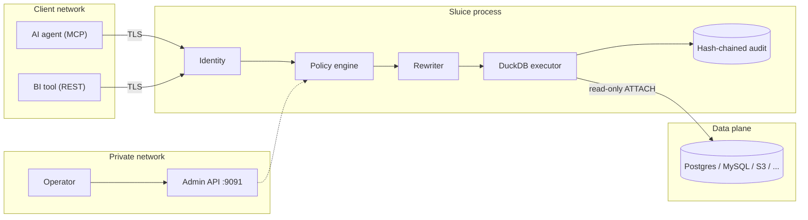

<!-- SPDX-License-Identifier: CC-BY-4.0 -->

# Threat model

The full STRIDE analysis — per component, with the attack-surface inventory —
lives in
[`THREAT_MODEL.md`](https://github.com/bino-bi/sluice/blob/main/THREAT_MODEL.md)
at the repository root; it is amended by pull request, and material changes go
through an RFC. This page summarizes what Sluice protects, against whom, and
with which concrete mechanisms.

## Assets

| Asset | Why it matters |
|---|---|
| Query results | May contain PII, financial data — anything in the attached databases |
| Policy snapshot | Defines who sees what; tampering equals bypass |
| Identity material | JWT signing keys, API-key pepper, HMAC secrets |
| Driver credentials | Database passwords, S3 keys, MotherDuck tokens |
| Audit log + genesis seed | Evidence of every query; the seed anchors the hash chain |
| Admin token | Grants policy introspection and reload |

## Adversaries

- **The over-privileged agent** — an AI agent wired to a broad database role
  it should never have had. Sluice narrows it to exactly the tables, rows,
  and columns its policies allow.
- **The prompt-injected agent** — an agent whose instructions were hijacked
  mid-conversation and now tries writes, bulk dumps, or off-limits tables.
- **The curious analyst** — a legitimate user probing beyond their remit:
  other tenants' rows, unmasked PII, aggregate fishing.
- **The stolen API key** — a leaked credential replayed from outside.

## Trust boundaries

## Scenario → mechanism

| Scenario | Mechanism | Outcome |
|---|---|---|
| Agent queries a table nobody allowed | Default-deny + `SqlAccessPolicy` | `ACL_DENIED` |
| Injected agent attempts `INSERT`/`UPDATE`/`DELETE` | Statement allowlist (SELECT-only execution) | `ACL_REJECTED` |
| Injected agent attempts DDL, `COPY`, `ATTACH` | Statement allowlist | `ERR_UNSUPPORTED_SYNTAX` |
| Cross-tenant row access | `RowFilterPolicy` — predicates injected as bound `$N` parameters | Rows filtered |
| Reading PII columns | `ColumnMaskPolicy` (partial, hash, fpe, fake, ...) | Values masked |
| Bulk exfiltration in one query | `QueryRewritePolicy` LIMIT clamp + sampling | Result bounded |
| Bulk exfiltration over many queries | Per-subject daily budgets (`rowsPerDay`, `cpuSecondsPerDay`) | `ERR_BUDGET_EXCEEDED` |
| Runaway agent loop | Per-subject rate limits (token bucket) | `ERR_RATE_LIMITED` |
| Risky SQL shapes (`SELECT *`, missing `WHERE`) | `QueryRejectPolicy` CEL rules | `ACL_REJECTED` |
| Sensitive query needs a human decision | `ApprovalPolicy` + single-use capability URLs (unknown id or bad token returns a uniform 404) | Parked until approved |
| Stolen API key | Peppered HMAC hashes (no key material at rest), rate limits and budgets bound the blast radius, the audit chain shows exactly what the key did | Contained + attributable |
| Audit log tampering | Hash chain + `sluice audit verify --anchor` | Detected at the exact line |

Rate limiting and budgets are enforced today, per `SubjectBinding` — see
[Subjects, keys & budgets](../policies/subjects.md).

## Residual risks

- **CASE oracle in column masks.** A masked column can still be referenced in
  `WHERE email = 'victim@example.com'` — the result-set shape leaks whether
  the value exists. Deny such predicates with a `QueryRejectPolicy` where
  this matters; see [Column masks](../policies/column-masks.md).
- **Jailbreak of the agent itself.** Sluice bounds *what data an agent can
  obtain*, not what the agent does with data it is legitimately allowed to
  read. A hijacked agent can still exfiltrate its permitted slice through its
  own output channel.
- **Aggregate inference.** Repeated aggregates over filtered or masked data
  can narrow down individual values. Budgets, rejects, and audit review
  reduce the bandwidth of this channel but do not close it.

## Non-goals

Sluice does not replace: hardening of the upstream databases (users who hold
direct credentials bypass Sluice entirely), network and host security of the
machine it runs on, a write-path gateway (execution is read-only), or the
security of the secret store backing `secret://` references.

Found something not covered here? Report it via
[`SECURITY.md`](https://github.com/bino-bi/sluice/blob/main/SECURITY.md).
